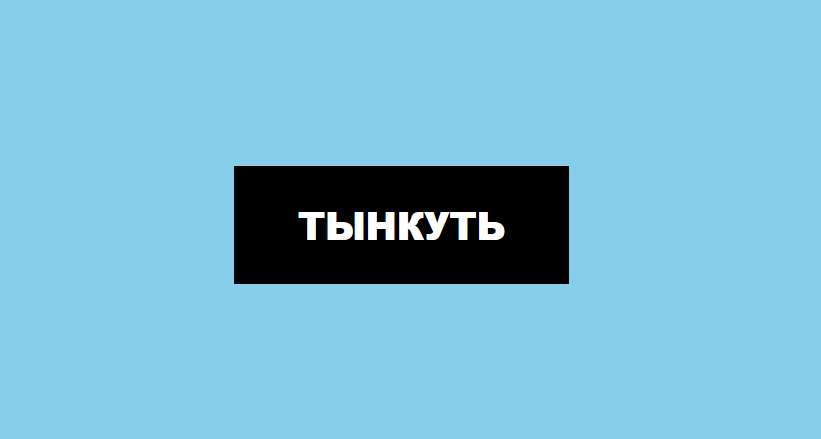
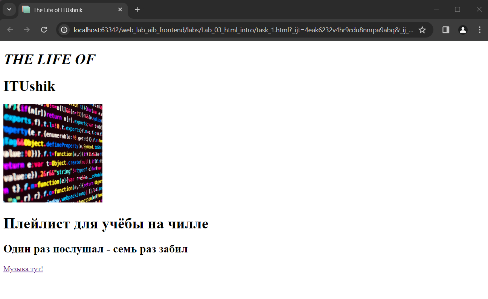

# Милащенко Н.С АИБ-3-044
___________________________________________________
## Лабораторная работа №3
В данной работе нужно познакомиться с вёрсткой страниц, HTML и стилями.
### Цель работы
Работа состоит из нескольких связанных между собой заданий. Предпочтительно для выполнения работы использовать браузер Google Chrome. В других современных браузерах тоже имеются инструменты разработчика и их функционала достаточно для выполнения данных заданий, но отличия в интерфейсе самых инструментов может сильно затруднить вашу задачу.
___________________________________________________
### Задание для работы
#### 0. Нам нужна кнопка (результат выполненных действий) :
```html
<!DOCTYPE html>
<html lang="ru">
<head>
    <link rel="stylesheet" href="style.css"/>
    <meta charset="UTF-8" />
    <meta name="viewport" content="width=device-width, initial-scale=1.0" />
    <title>Кнопка</title>
</head>
<body>
<button>Тынкуть</button>
</body>
</html>
```
Скриншот:


#### Остальные задания в файле task_1.html
```html
<!DOCTYPE html>
<html lang="ru">
<head>
    <meta charset="UTF-8" />
    <meta name="viewport" content="width=device-width, initial-scale=1.0" />
    <link rel="icon" type="image/png" href="imgs/playlist-favicon.ico">
    <title>The Life of ITUshnik</title>
</head>
<body>
    <h1 style="font-size: 31px; text-transform: uppercase; font-style: italic;">THE LIFE OF</h1>
    <h1 style="font-size: 31px;">ITUshik</h1>

    

    <h1>Плейлист для учёбы на чилле</h1>
    <h2>Один раз послушал - семь раз забил</h2>
</body>

<a href="https://music.yandex.ru/users/ya.indietronica/playlists/1013" target="_blank">Музыка тут!</a>
</html>
```
Скриншот:

