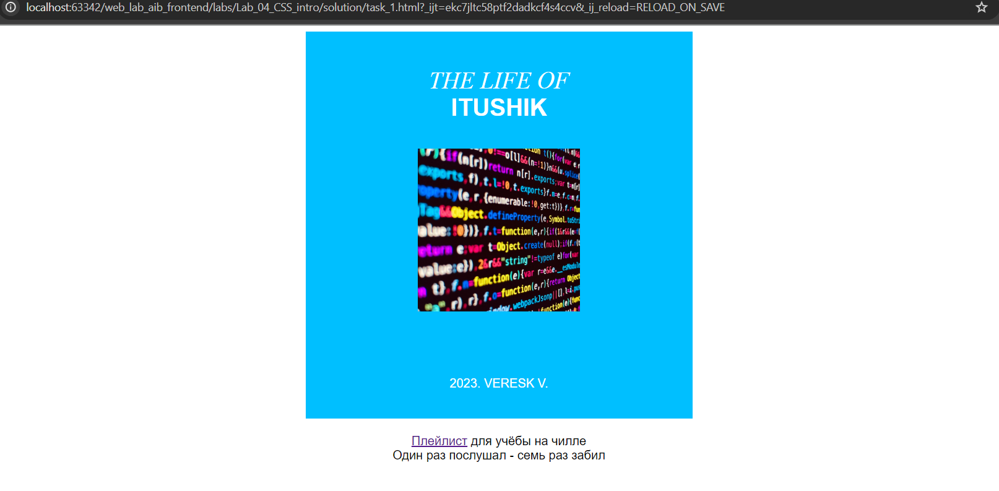

# Знакомство с CSS и продолжение HTML
___________________________________________________
## Лабораторная работа №4
В данной работе нужно познакомиться с вёрсткой страниц, HTML и стилями.
___________________________________________________
### После всех выполенных шагов и инструкций по лабораторной работе №4, у меня получился следующий результат:

Файл - style.css
```css
html {
    height: 100%;
}
body {
    min-width: 850px;
    text-align: center;
}
h1, p {
    margin: 0px;
    padding: 0px;
}
h2{
    margin: 0px;
    padding: 0px;
    margin-bottom: 35px;
}
h1 {
    font-family: William, serif;
    font-size: 31px;
    text-transform: uppercase;
    padding-top: 45px;
    font-weight: normal;
    color: white;
    font-style: italic;
}
h2 {
    font-family: Inter, sans-serif;
    font-size: 31px;
    color: white;
    text-transform: uppercase;
}
h3 {
      font-family: 'Inter', sans-serif;
      font-size: 16px;
      text-transform: uppercase;
      line-height: 18px;
      font-weight: normal;
      color: white;
      margin: 0;
      padding: 0;
}
p {
    font-family: Inter, sans-serif;
    text-align: center;
}
img {
   alt: "Супер-пупер стильный код";
   width: 210px;
   height: 210px;
   margin-bottom: 80px;
}

div {
  text-align: center;
  background-color: deepskyblue;
  width: 500px;
  height: 500px;
  margin: 0 auto 20px;
}

```
Файл task_1.html
```html
<!DOCTYPE html>
<html lang="ru">
<head>
    <meta charset="UTF-8" />
    <link rel="stylesheet" href="style.css"/>
    <meta name="viewport" content="width=device-width, initial-scale=1.0" />
    <link rel="icon" type="image/png" href="imgs/playlist-favicon.ico">
    <title>The Life of ITUshnik</title>
</head>
<body>

</body>

<div>
    <h1>THE LIFE OF</h1>
    <h2>ITUshik</h2>
    
    <h3>2023. Veresk V.</h3>
</div>

<p><a href="https://music.yandex.ru/users/ya.indietronica/playlists/1013" target="_blank">Плейлист</a> для учёбы на чилле</p>
<p>Один раз послушал - семь раз забил</p>

</html>
```
Скриншот работы веб-странички:
