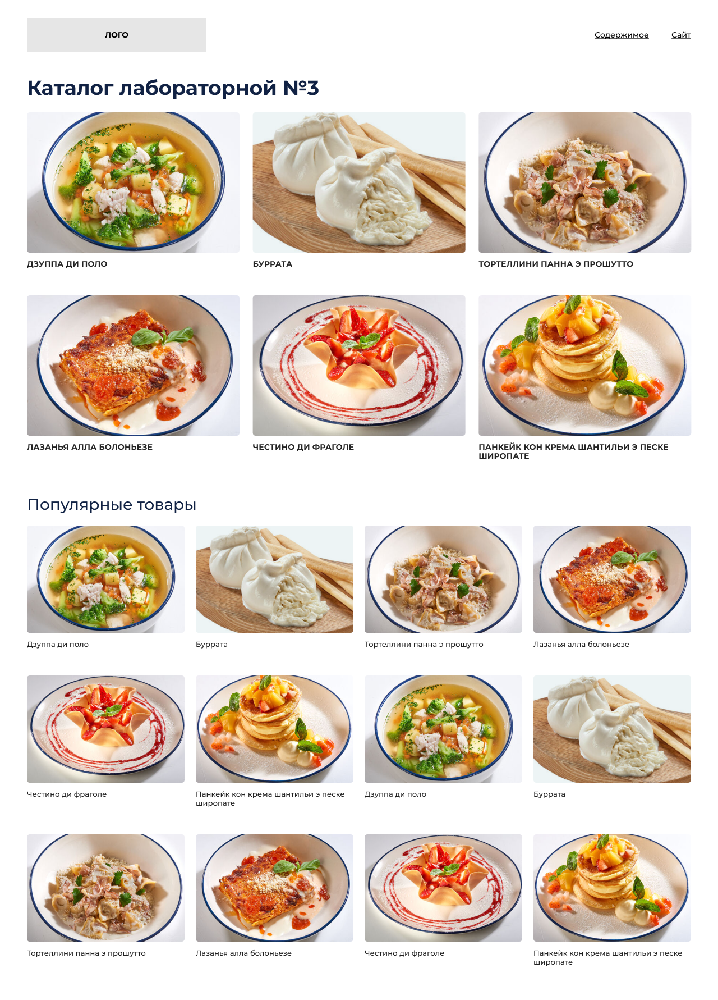

# Работа с HTML и CSS. Простые приёмы работа с DOM и BOM.

## Задание №1. Разработка HTML-документа

1. Разработайте валидный HTML-документ (файл .html, содержащий валидный HTML-код), содержащий все базовые теги документа.
2. Создайте пустой файл таблицы стилей и подключите его в свой документ.
3. Создайте пустой файл JavaScript и подключите его в свой документ.
4. Задайте название документу "Лабораторная работа №3" (название документа выводится на вкладке этого документа в браузере)
5. Укажите кодировку документа в HTML
6. Добавьте на страницу шапку, внутри которой расположите логотип любой организации, имеющей сайт (на ваш выбор) и навигацию состоящую из двух ссылок: "Содержимое" (якорь на тег main ниже шапки) и "Сайт" (ссылка на реальный сайт организации, чей логотип вы использовали)
7. Ниже шапки расположите блок основного содержимого страницы, содержащий заголовок 1-го уровня с текстом "Каталог лабораторной №3".
8. Под заголовком расположите блок с классом "main-catalog", и содержащий внутри ещё 6 блоков с классом "item".
9. В блоке основного контента, ниже блока main-catalog, расположите ещё один блок с классом "promo-catalog", внутри которого поместите заголовок 2-го уровня "Популярные товары" и 12 блоков с классом item.
10. Заполните все блоки с классом item информацией из любых реальных товаров, любого реального интернет-магазина или возьмите из примера ниже. Каждый блок item должен содержать изображение товара и его название. Можете дополнить дополнительной информацией на ваше усмотрение, например, ценой

---------------------------

## Задание №2. Стили мобильной версии

Прочитайте про подход Mobile First и в соответствии с ним сначала задайте стили мобильной версии и протестируйте в браузере отображение получившегося документа при логической ширине экрана 320, 414 и 640 пикселей. Прикрепите к отчёту скриншоты на каждом из этих разрешений.

1. Логотип нужно отцентрировать по горизонтали и задать отступы со всех сторон по 12px.
2. Ссылки вывести под логотипом в одну строку, текст должен быть с подчёркиванием, при наведении подчёркивание должно пропадать.
3. Карточки товаров внутри main-catalog должны располагаться на всю ширину экрана, но с отступами от краёв в 12px. Вертикальные отступы между товарами должны быть 20pх.
4. Карточки товаров внутри promo-catalog должны располагаться по 2 в строку, с горизонтальным отступом между карточками 12px.
5. В карточках товаров изображения по ширине должны быть всегда на 100% своего родительского блока (item), а по высоте они должны сохранять свою исходную пропорцию.
6. При наведении курсором на товар (на всю карточку / блок item) изображение этого товара должно становиться на 40% прозрачным (реализовать исключительно на CSS)

---------------------------

## Задание №3. Адаптация под десктопы

Адаптируйте вёрстку под экраны с логической шириной 1280px и более. Прикрепите к отчёту скриншоты получившейся вёрстки при ширине экрана 1280 и 1440 пикселей.

1. Отступы контента от краёв вкладки браузера нужно увеличить до 40px.
2. Логотип выровнять по левому краю. Меню выровнять по правому краю, а вертикально расположить на одном уровне с логотипом (то есть рядом с логотипом).
3. Увеличить все заголовки и вертикальные отступы (итоговые размеры - на ваше усмотрение).
4. Расположите по 3 карточки товара (item) в строку внутри блока main-catalog, горизонтальный отступ между карточками - 24px. 
5. Расположите по 4 карточки товара (item) в строку внутри блока promo-catalog, горизонтальный отступ между карточками - 20px.

---------------------------

## Задание №4. Промежуточная версия

Не обязательное задание, для тех, кто хочет получить больше практики.

1. Самостоятельно придумайте сетку расположения товаров в каждом из двух блоков в диапазоне логической ширины экрана от 640 до 1280 пикселей. 
2. Не обязательно это должна быть одна сетка - Вы можете реализовать сразу несколько сеток для разных диапазонов, если считаете это нужным. Например вы можете в диапазоне 620-768 сделать по 3 товара в каждой строке в блоке promo-catalog, но не менять ничего в main-catalog. Начиная с 768 пикселей выводить по 2 товара в строках main-catalog. Начиная 960 вывести по 4 товара в promo-catalog, а начиная с 1140 вывести по 3 товара в main-catalog.
3. Если выполняете это задание, сделайте скриншоты при ширине экрана 768, 960 и 1140 пикселей.

---------------------------

## Задание №5. Использование CSS Grid

Не обязательное задание, для тех, кто хочет более полно освоить современные методы вёрстки.

Попробуйте просто реализовать те же самое задания 1-3, но используя только CSS Grid, без использования flex, float, table и position.
